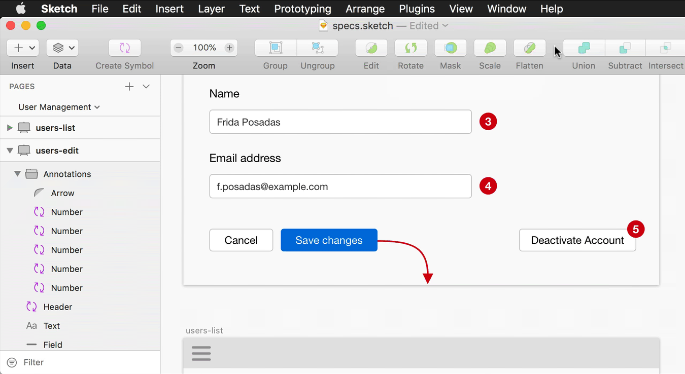

# Annotations Sketch Plugin

This is a [Sketch](https://www.sketchapp.com/) plugin for hiding/showing annotations on a functional specifications document. It toggles the visibility of all layer groups named `Annotations`. It runs on all pages and artboards of the open document.

It's useful when you use a same Sketch document for exporting:

- Images – _with_ annotations
- Prototypes – _without_ annotations

 

    

# Installation

1. Download the latest version of the plugin.

2. Double-click the `annotations.sketchplugin` file to install it.

3. You should see the new "Annotations" entry in your Plugins menu.

# Developers

_This plugin was created using `skpm`. For a detailed explanation on how things work, checkout the [skpm Readme](https://github.com/skpm/skpm/blob/master/README.md)._

