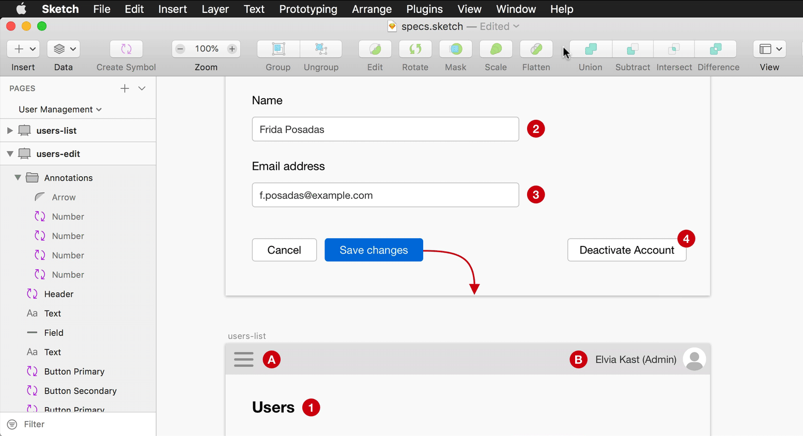
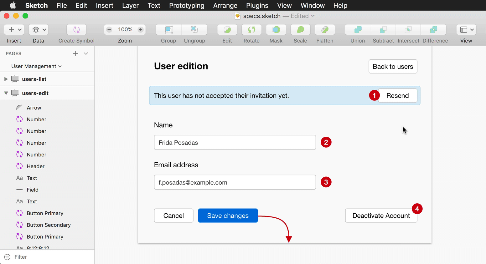
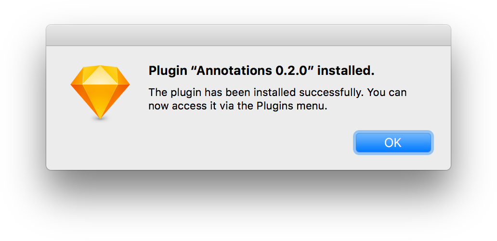
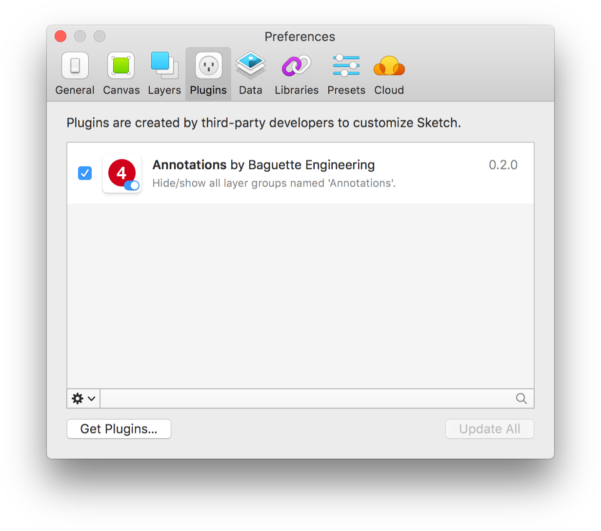
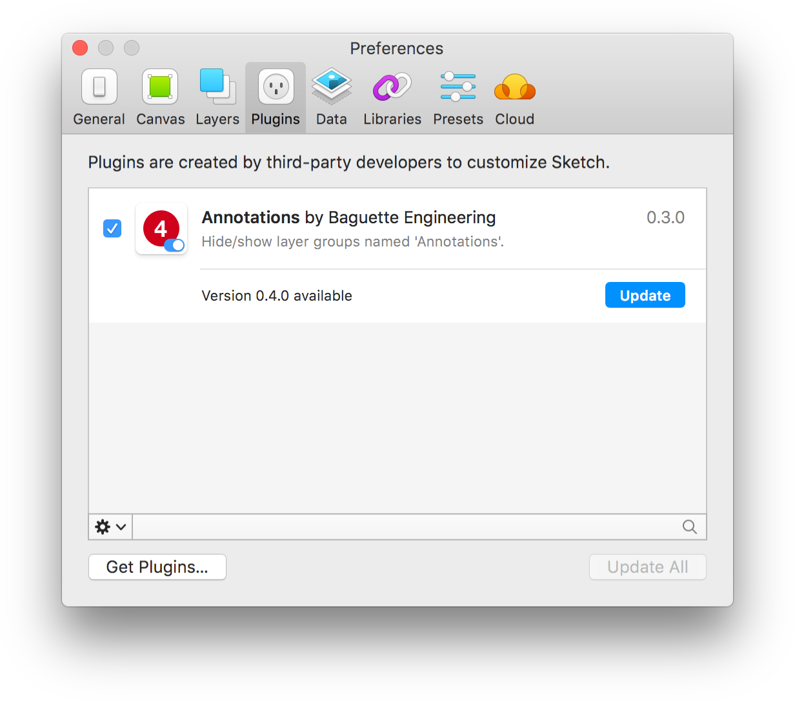

# Annotations Sketch Plugin

This is a [Sketch](https://www.sketchapp.com/) plugin for hiding/showing annotations on a functional specifications document. 

It's useful when you use a same Sketch document for exporting:

- Images – **_with_** annotations
- Prototypes – **_without_** annotations

## Hide and show annotations

The `Hide` and `Show` commands control the visibility of all layer groups named "Annotations". They impact annotations on all pages and artboards of the open document.

    

## Create new annotations

Put your annotations in groups named "Annotations". You can create these groups manually, or use the command `Create 'Annotations' group from selection`.

    

# Installation

**1.** Download the [latest version of the plugin](https://github.com/BaguetteEngineering/annotations-sketch-plugin/releases/download/v0.4.0/annotations.sketchplugin.zip) (v0.4.0).

**2.** Unzip the file.

**3.** Double-click the `annotations.sketchplugin` file to install the plugin.

    

**That's it!** You should see the Annotations plugin in "Plugins > Manage Plugins...".

    

# Update

Sketch will notify you when a new version is available.

    

# Developers

This plugin was created using `skpm`. For a detailed explanation on how things work, checkout the [skpm Readme](https://github.com/skpm/skpm/blob/master/README.md).

